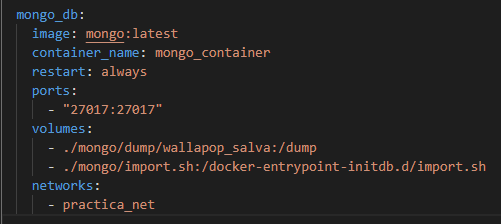
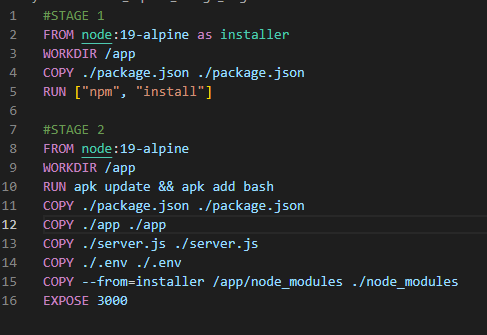
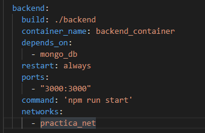
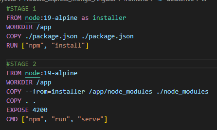
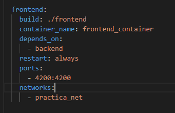
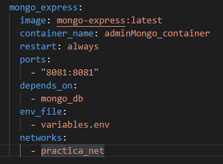
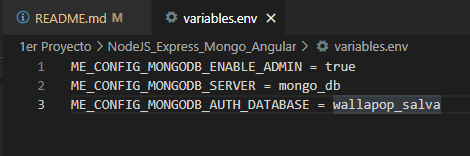
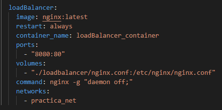

<h1>DOCKER COMPOSE</h1>

Dockerización del proyecto de NodeJs/Angular13. 
  
Un proyecto realizado por el alumno <a href="https://github.com/Salmu10">Salva Muñoz Úbeda</a> en el 1er curso de DAW en el <a href="https://portal.edu.gva.es/iestacio/">IES L'estació</a>. 
  
Este proyecto trata sobre una página web de venta de productos de segunda mano, al estilo wallapop,  sobre la cual se pueden realizar distintas funciones.

  
<h3>CONTENEDOR MONGO</h3>
 

Para el contenedor de la base de datos, que en este caso es mongodb, primeramente, hacemos 
una copia de la base de datos usada en el proyecto, para ello, usamos el comando "mongodump -d <database name> -o <target directory>"
guardaremos esta carpeta de nuestra base de datos en una carpeta llamada "dump" que a su vez se encontrará en la carpeta de mongo.
Además, crearemos un fichero .sh con el comando "mongorestore -d <database name> /dump" para insertar nuestra base de datos en el 
contenedor de mongo.

Solo nos quedará terminar de configurar el contenedor de mongo, agregando la red (practica_net), los puertos, etc.
El resultado será parecido al siguiente:

<h3>CONTENEDOR BACKEND</h3>

Para el contenedor de backend, primero, deberemos crear un fichero dockerfile dentro de la carperta de backend en el qual, partiendo 
de una imagen "node:19-alpine", haremos dos stages estructurando el contenedor y exponiendo el pureto 3000.

Una vez creado el dockerfile, crearemos el contenedor en el docker-compose.yml, el cual se iniciará después del contenedor de mongo y 
ejecutará el comando que inicia el servidor. Además, tendrá que estar en la misma red que el contenedor de mongo y el resto de contenedores.

<h3>CONTENEDOR FRONTEND</h3>

Como en el contenedor anterior, en el contenedor de frontend también tendremos que crear un dockerfile con dos stages configurando el contnedor. Esta vez, exponemos el puerto 4200.

Una vez creado el dockerfile, crearemos el contenedor en el docker-compose.yml, el cual se iniciará después del contenedor de backend,
esta vez, el comando de arranque lo ejecuta el dockerfile así que no hará falta ponerlo en el docker-compose.yml. Además, tendrá que estar 
en la misma red que el contenedor que el resto de contenedores.

<h3>CONTENEDOR MONGO-EXPRESS</h3>

Este contenedor nos permitirá administrar la base de datos de mongo. En el solo tendremos que asignar la
imagen que utilizará, el puerto que usará y que arrancará después del contenedor de mongo. Además, de añadirlo a la misma red que el resto de contenedores.

En un archivo aparte deberemos añadir las variables de entorno que necesita el contenedor para funcionar, este archivo será un .env y estará en la carpeta general. Se llamará a este archivo desde el docker-compose.

<h3>CONTENEDOR LOADBALANCER</h3>

El siguiente contenedor nos permitirá implementar un sistema de balanceo de carga/proxy en nuestro sistema. Partirá de la imagen oficial de nginx y asociará un fichero de configuración de nginx que se encontrará en la carpeta de loadbalancer con el mismo fichero de la carpeta /etc/nginx/ de la imagen lo que permitirá implementar el balanceador de carga. Además, el contenedor ejecutará el comando "nginx -g daemon off" nada más arrancar.

<h2>PUESTA EN MARCHA</h2>

Es necesario crear el fichero .env en la carpeta de servidor.

Tener instalado las siguientes herramientas: 

- NodeJS V16.17.0 
- Angular V13 
- MongoDB

<h3>BACKEND</h3>
<ol>
  <li>cd server</li>
  <li>npm install</li>
  <li>npm run dev</li>
</ol>

<h3>FRONTEND</h3>
<ol>
  <li>cd client</li>
  <li>npm install</li>
  <li>npm start</li>
</ol>

<h2>LIBRERÍAS</h2>

Lista de librerías utilizadas en este proyecto:

<ul>
  <li><a href="https://codeseven.github.io/toastr/">Toastr</a></li>
  <li><a href="https://fontawesome.com/">Font Awesome</a></li>
  <li><a href="https://www.flaticon.es/">Flaticon</a></li>
  <li><a href="https://avatars.dicebear.com/">DiceBear Avatars</a></li>
</ul>
 
